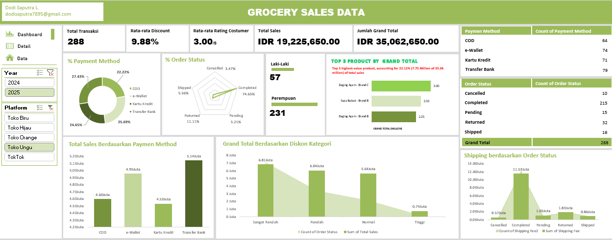

# 📊 Grocery Sales Dashboard Analysis

An interactive data analysis project that explores grocery sales performance using structured KPIs and dashboard visualization to uncover actionable business insights.

---

## 📌 Project Overview
This project analyzes 2,000 grocery transactions to evaluate sales performance, customer behavior, and operational efficiency.

Despite the relatively small dataset, the dashboard demonstrates how well-defined KPIs and thoughtful visualization can still deliver meaningful insights and support data-driven decision-making.

---

## 🎯 Objectives
- Analyze overall sales performance  
- Identify top-performing products and categories  
- Understand customer demographics and behavior  
- Evaluate operational efficiency and transaction outcomes  
- Support strategic business decisions through data insights  

---

## ⚙️ Tools & Technologies
- Microsoft Excel  
- Pivot Table  
- Data Cleaning & Transformation  
- Data Visualization  

---

## 📊 Dashboard Features
- 📈 Sales performance overview  
- 🛒 Product and category analysis  
- 👥 Customer demographic insights  
- 💳 Payment method distribution  
- 📦 Order status and operational metrics  
- 🎛 Interactive filtering using slicers  

---

## 🧩 Data Workflow
Data Cleaning → Data Transformation → KPI Definition → Pivot Analysis → Dashboard Visualization

---

## 📸 Dashboard Preview
*(Add your screenshot here)*

---

## 📈 Key Insights

### 💰 Sales Performance
- Total sales reached **IDR 128.49 million** from 2,000 transactions  
- Average discount was **9.71%**, influencing purchasing behavior across categories  

### ⭐ Customer Experience
- Average rating: **2.98 / 5 (59.6%)**  
- Indicates solid sales performance but highlights opportunities to improve customer satisfaction and product quality  

### 👥 Customer Demographics
- Female customers dominate the market (**80.05%**)  
- Male customers account for **19.95%**  
- Suggests strong potential for targeted marketing strategies  

### 🏆 Product Performance
- **Powdered Milk** and **Chicken Meat (Brand C)** are the top revenue contributors  
- These products represent key drivers of business performance  

### 💳 Payment Behavior
- Payment methods are well distributed across:
  - Bank Transfer  
  - COD  
  - Credit Card  
  - E-Wallet  
- **Bank Transfer** generates the highest revenue (**IDR 33.86 million**)  
- Indicates importance of offering flexible payment options  

### 📦 Operational Performance
- **74.65%** of orders successfully completed  
- Returns and cancellations still represent a notable portion  
- Highlights opportunity to improve fulfillment and reduce post-purchase issues  

### 🚚 Cost & Pricing Insight
- Majority of revenue comes from **low-discount transactions**  
- Completed orders contribute the highest shipping costs  
- Indicates the need for logistics and cost optimization  

---

## 🚀 How to Use
1. Open the Excel dashboard file  
2. Use slicers to filter data  
3. Explore trends across categories, time, and customer segments  
4. Analyze KPIs to gain business insights  

---

## 📌 Future Improvements
- Integration with SQL database  
- Advanced analysis using Python  
- Predictive modeling for sales forecasting  
- Improved dashboard interactivity  

---

## 👤 Author
**Dodi Saputra**  
Aspiring Data Analyst  

📬 Open for feedback and collaboration
